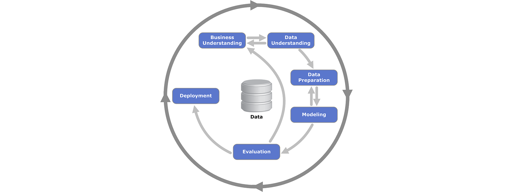

# Predict Voter Propensity with a Linear Regression Model

### About

Running for office is a daunting task, especially for candidates who have never run before. During the campaign, candidates have to convince as many people as possible to vote for them. There’s never enough time or money, so candidates have to be efficient and focus on the voters who actually vote. But is it possible to predict which voter is more likely to go to the polls?

This project explores some publicly available voting data to to learn more information about a group of voters, and to use data ro predict voting propensity.

This repository supplements the [Use voter data… win elections!](https://medium.com/@lajos.kamocsay/use-voter-data-win-elections-e9a68862cbed) story on [medium](https://medium.com/@lajos.kamocsay/use-voter-data-win-elections-e9a68862cbed).

### Installation

This project uses [jupyter](https://jupyter.org/) notebooks. The **requirements.txt** file contains information about required packages. Create a [conda](https://anaconda.org/) environment with all required packages:

`conda create --name <env> --file requirements.txt`

### Files in this repository

**/data/voting_data_anonymized.tsv** - anonimized public voting data in tab separated format
**a quick look at the data.ipynb** - notebook exploring the data
**linear regression.ipynb** - notebook with data preparation, linear regression modeling and prediction testing
**/cover_image** folder containing illustrations and a python file to create the randomized cover image

### CRISP-DM process

This project uses the [cross-industry standard for data mining](https://en.wikipedia.org/wiki/Cross-industry_standard_process_for_data_mining) (CRISP-DM) process model. An overview of how this project breaks down to the six phases of the model:

1. **Business Understanding** - Polotical campaigns try to identify frequent voters so they can most efficiently utilize their resources. In this project we use publicly available voter records and machine learning to predict voter propensity.
2. **Data Understanding** - We look at the data to find out what columns we have, what values the columns contain and to gain some understanding of the voter base in the **a quick look at the data.ipynb** notebook.
3. **Data Preparation** - The first tasks in the **linear regression.ipynb** notebook impute data in columns with missing values, convert categorical columns to numerical ones, and augment the data to enhance the accuracy of the linear regression model.
4. **Modeling** - Next in the **linear regression.ipynb** notebook we fit a linear regression model on the data to predict the 2020 turnout. Then we expand that model to predic the 2021 turnout.
5. **Evaluation** - Since we already have the 2021 turnout data, we look evaluate how the linear regression model's accuracy compares to traditional methods used in campaigns.
6. **Deployment** - Deploymant is not in the scope of this project.

### Acknowledgements

https://pixabay.com/users/coffeebeanworks-558718/ - illustrations used in cover image by coffeebeanworks

https://github.com/appeler/ethnicolr - name based data labeling for race and color

